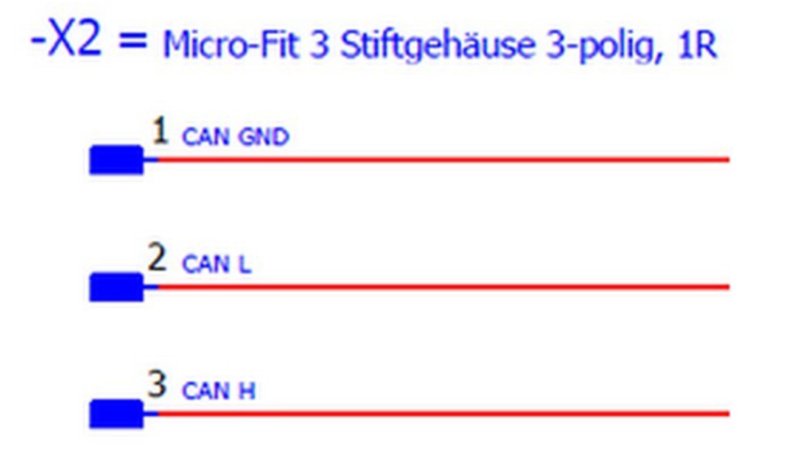
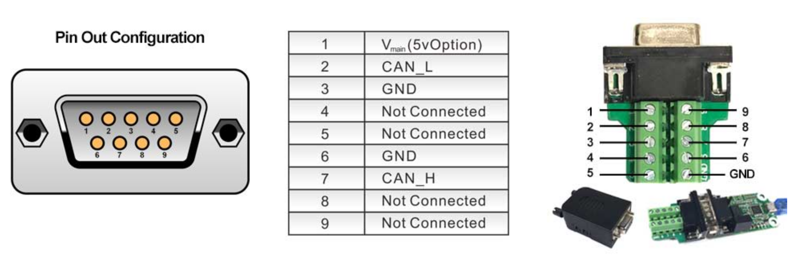
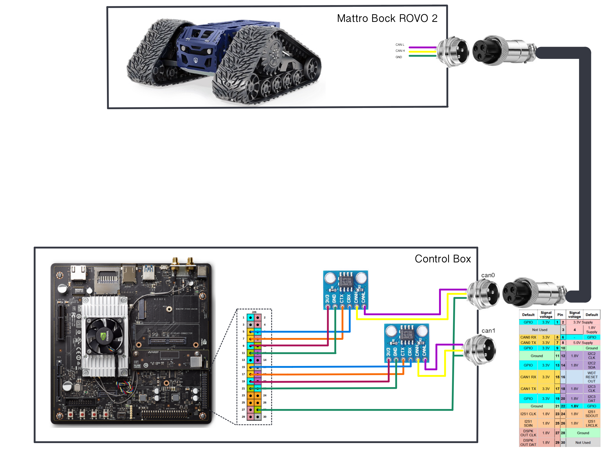

# ROS Controller for Mattro Bock Rovo 2
*Study Project of Galli Davide*

*Free University of Bolzano - Master in Industrial Engineering*
## Introduction to the project
This repository contains a ROS controller written in Python for the Mattro Bock ROVO 2. It exploits the CAN Bus communication to get and send data to the motors' drivers in order to drive the robot.

## Mattro Rovo 2 CAN communication

To communicate with the motor driver, a USB-to-CAN board is used, even though the Jetson TX2 supports natively CAN communication.
This board uses a USB-A connector on one side and a DB9 serial connector on the other.
The matching of the CAN channels and the pins is given below.

- pin 2 &rarr; CAN L

- pin 3 &rarr; GND

- pin 7 &rarr; CAN H




## Compute the robot speed

Given a value of rpm, it is possible to compute the speed af the track.

$$ v = \frac{rpm \cdot \phi_{wheel}\cdot \pi}{y \cdot 60}\cdot 3.6$$

where:

- $v$ is the speed of the robot in [km/h]

- $\phi_{wheel}$ is the wheel diameter &rarr; 0.35 for heavy duty version

- $y$ is the gear ratio &rarr; 7 or 16

Speed is expressed in percentage from 0 up to 1000, where the 1000% corresponds to the maximum speed which is 20 [km/h].

Since the robot employes a skid steering driving system, the speed of each track should be computed starting from the overall linear speed $v_x$ and angular velocity $\omega $.

$$ v_r = v_x - \omega \cdot \frac{d_{wheels}}{2}$$

$$ v_r = v_x + \omega \cdot \frac{d_{wheels}}{2}$$

where $d_{wheels}$ is the distance between the two tracks.

## Jeston TX2 CAN communication

The Jetson TX2 supports natively CAN communication. Indeed, it as already built-in two CAN ports that can be used via J26 header. A brief schematic of a possible circuit is reported below.



To actively use the on-board CAN ports, some requirements must be met:

- Nvidia Jetson TX2 Developer Board
- Flash Jetson TX2 with Jetpack 3.2
- Jumper wires
- 120 ohm resistor (optional)
- Transceivers (up to 2 for 2 CAN bus ports). For example: [Waveshare transceiver](https://www.amazon.com/gp/product/B00KM6XMXO/ref=as_li_tl?ie=UTF8&camp=1789&creative=9325&creativeASIN=B00KM6XMXO&linkCode=as2&tag=scratchroboti-20&linkId=d13fb19443698b5fee1d20a7122008e3)


<ins> How to wire </ins>

The Jetson TX2 developer board comes with 2 CAN controllers, hence one can have 2 different CAN ports by using 2 transceivers connecting to these CAN controllers.

Locate J26 / GPIO Expansion Header and its pin. You can find the spec of these pins on the Jetson TX2 Dev Kit Carrier Board Specification document at this [link](https://developer.nvidia.com/embedded/downloads) , all the documents are free to download but require a login.

<ins> Connecting Jetson and transceiver</ins>

**Can0**

> Pin 5 <-> CAN RX

> Pin 7 <-> CAN TX

> GND <-> GND

> 3.3v <-> 3.3


**Can1**

> Pin 15 <-> CAN RX

> Pin 17 <-> CAN TX

> GND <-> GND

> 3.3v <-> 3.3

<ins>Commands</ins>

If using Jetpack 3.2 or later, you won’t have to worry about enabling header for mttcan, this seems like a missing thing from earlier Jetpack version.

In a terminal, type following commands to setup CAN channels and their bitrate. The bitrate here is 500K but one can change to other numbers per  your need. I did test up to 1 million bit-rate.

```
sudo modprobe can
sudo modprobe can_raw
sudo modprobe mttcan
sudo ip link set can0 type can bitrate 500000
sudo ip link set up can0
sudo ip link set can1 type can bitrate 500000
sudo ip link set up can1
```

In another terminal, check if the CAN bus are set up

```
ifconfig
```

Install can-ultils to send and receive CAN message over terminal

```
sudo apt-get install can-utils
```

<ins>Example of sending and receiving a CAN message </ins>

For example, you connect both can0 to can1 together. You want to send a sample message from can0 and receive from can1.

In one terminal, run:

```
candump can1
```

In another terminal, run, for example:

```
cansend can0 01a#11223344AABBCCDD
```

If the message was sent successfully, you will see the message on can1’s terminal

<ins> Possible errors </ins>

The transceiver do not come with a terminal resistor (120 ohm) built-in. If the other CAN device you connect to also does not have the terminal resistor, you need to insert one into the system to get the message flow through. Otherwise, all messages would go into error state.


## Initial set up the Jetson TX2 ##
To enable CAN Bus, some kernel modules must be loaded, hence in a new terminal, run the following commands:

```
sudo modprobe can
sudo modprobe can_raw
sudo modprobe mttcan
```
Once the modules are loaded, the actual CAN interface can be set up. 

Again, in a terminal run:
```
sudo ip link set can0 type can bitrate 500000
sudo ip link set up can0
```
To enable the IMU over USB, in a terminal run:
```
sudo chmod a+rw /dev/ttyUSB
```
All this operations can be done together by means of a simple bash script saved under src/utils. To run it, open a terminal, move into the folder and type:
```
./ros_setup.sh
```
<ins> !! It needs root permission !! </ins>

This will run all the aforementioned commands and will also star a roscore session.
Now, everything is ready to run nodes.

## Set up ROS environment

To run nodes from your local PC is fundamental to properly set up your ROS environment. Indeed, the ROS master must be the Mattro and not your local PC.
Therefore, the bashrc file should be edited. To open it, run:
```
sudo gedit ~/.bashrc
```
Then add the following lines to it.
```
export ROS_HOSTNAME=xxx.xxx.xxx.xxx
export ROS_IP=192.168.8.17
export ROS_MASTER_URI=http://192.168.8.17:11311
```
where *ROS_HOSTNAME* is the ip address of your local PC.

Then, please connect to **Eminent** wifi (free wifi). To check, try to run: 
```
rostopic list
```
If an output is given, everything is ready to go. Now you can launch nodes and access topics also from your remote PC.

To connect to the Jetson remotely, **ssh** can be used as follows:
```
ssh first@192.168.8.17
```


## To run the controller

Once the CAN interface is up and running, the IMU is connected, the Pozyx system is wokring properly and a roscore session is running, there are a bunch of options:
1. To launch only the motor controller, run the following in a terminal:
```
roslaunch bock_controller bock_controller.launch
```
2. To launch only the broadcasting of the robot pose, run the following in a terminal:
```
roslaunch bock_controller bock_pose.launch
```

3. To launch only the entire navigation system, run the following in a terminal:
```
roslaunch bock_controller bock_navigation.launch
```

4. To test the odometry filterd, run the following in a terminal:
```
roslaunch bock_controller bock_odom_filtered.launch
```

If *bock_navigation* or  *bock_pose* is already running and you want to visualise the robot from your local PC, run the following in a terminal:
```
roslaunch bock_controller bock_display.launch
```
!! Keep in mind that there must be a display available, since rviz is a software with a graphical interface. Hence, it is not possible to run it on Jetson whenever it is not attached to an external monitor.

## Square path demo

To execute the demo, run in a terminal:
```
roslaunch bock_controller bock_demo_square.launch
```

## Dependencies

To work properly, the ROS controller exploits third parties ROS packages that must be clone in the *src* folder of the ROS workspace. Those are reported in the references and can be easily installed as follows.

First of all, open a terminal and move into *my_ros_workspace/src* folder.

To install the *robot_localization* package, run:

```
git clone -b melodic-devel https://github.com/cra-ros-pkg/robot_localization.git
```

To install the *xsens_ros_mti_driver* package, follow the isntructions reported [here](http://wiki.ros.org/xsens_mti_driver).


## References

- [Innomaker USB to CAN Converter Module](https://www.amazon.it/Modulo-convertitore-USB-Raspberry-Zero/dp/B07Q812QK8/ref=sr_1_7?keywords=can+usb+adapter&qid=1647593956&sprefix=USB+CAN+adap%2Caps%2C79&sr=8-7)
- [Innomaker website](http://wiki.inno-maker.com/)
- [Nvidia forum 1](https://devtalk.nvidia.com/default/topic/1025010/jetson-tx2/how-to-use-can-on-jetson-tx2-/)
- [Nivida forum 2](https://devtalk.nvidia.com/default/topic/1006762/jetson-tx2/how-can-i-use-can-bus-in-tx2-/3)
- [SG Framework](https://sgframework.readthedocs.io/en/latest/cantutorial.html)
- [Xsense ROS node](https://github.com/xsens/xsens_mti_ros_node)
- [Robot Localization ROS package](https://github.com/cra-ros-pkg/robot_localization)
- [Coordinate Frames for Mobile Platforms](https://www.ros.org/reps/rep-0105.html)